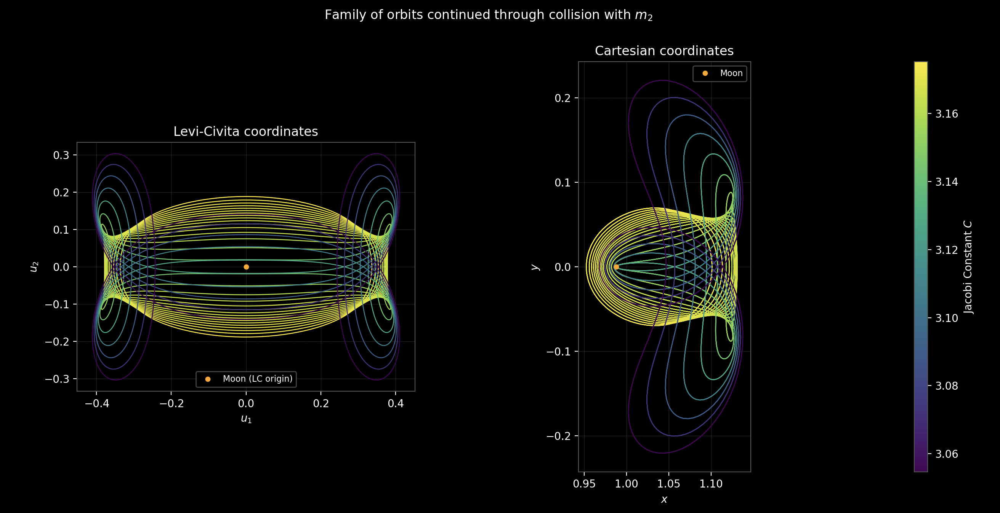

# Cislunar-CR3BP-Research-UT-Austin

Computational research into periodic orbits, Levi-Civita regularization, 
pseudo-arclength continuation, and invariant manifold structure in the planar 
Earth–Moon Circular Restricted Three-Body Problem (CR3BP). Will hopefully relate L2 Lyapunov collision orbits to homoclinic collision orbits.

Undergraduate research project, University of Texas at Austin, Spring 2026.  
Supervisor: Dr. Luke Peterson.  

---

## Overview

The three-body problem lacks a general closed-form solution and requires numerical 
methods to analyse the motion of a third body, such as a spacecraft, under the 
gravitational influence of two primaries. This project develops and validates a 
suite of numerical and mathematical tools for computing and continuing periodic 
orbits in the Earth–Moon system, with particular focus on orbits that approach or 
pass through collision with one of the primaries.

A central challenge in this setting is the singularity that arises in the equations 
of motion as the third body approaches a primary. This is addressed through 
**Levi-Civita regularization**, which removes the singularity via a combined space 
and time transformation, enabling smooth numerical integration through collision 
events. The project is structured as a computational pipeline where each tool builds 
on the previous, currently culminating in an investigation of the invariant manifold 
structure of collision orbits continued from the L2 Lyapunov family and the possible homoclinic orbits found at the intersection of the stable and unstable invariant manifolds.

---

## Setup

  

<em>Selected periodic orbits from Broucke's 1968 catalog, 
reproduced as validation.</em>

---

## Pipeline

### Levi Civita Regularization
A local regularization method which in this project removes the singularity around $m_2$ (the moon) as the third body approaches collision. The method introduces a time and spatial transformation enabling closer inspection of ejection collision orbits.

### 1. Shooting method
Newton-based single-shooting to find and correct initial conditions yielding 
periodic orbits. Validated against Broucke's 1968 orbit catalog. Implemented for 
both Cartesian and Levi-Civita regularized coordinates.

### 2. Pseudo-arclength continuation
Predictor-corrector method tracing families of periodic orbits continuously through 
parameter space — including through collision events in regularized coordinates. 
The Jacobian is computed analytically via the State Transition Matrix (STM) and 
Monodromy matrix, with SymPy used for the LC coordinate partials.

### 3. Invariant manifolds
Stable and unstable manifolds computed from the eigenvectors of the Monodromy 
matrix and propagated forward/backward in time. Poincaré sections used to 
investigate homoclinic structure. Ongoing work focuses on collision orbits continued 
from the L2 Lyapunov family.

---

## Methods

| Method | Description |
|--------|-------------|
| **Cartesian EOM** | CR3BP equations of motion in synodic rotating frame |
| **Levi-Civita regularization** | Space + time transformation removing the r₂ singularity at lunar collision |
| **Numerical integration** | RK45 / RK8; implicit methods for near-collision unstable orbits |
| **Shooting method** | Newton iteration with minimum-norm step (overdetermined system) |
| **STM / Monodromy matrix** | Augmented ODE; Floquet multipliers for stability |
| **Pseudo-arclength continuation** | Null-space tangent predictor + Newton corrector with arclength constraint |
| **Invariant manifolds** | Eigenvector perturbation + forward/backward propagation |
| **Poincaré sections** | slicing method to investigate sections of the system by reducing the dimensionality |
| **SymPy** | Analytical Jacobians for LC EOM and ∂C/∂U₀ |

---

## Selected Results

  

<em>Selected periodic orbits from Broucke's 1968 catalog, 
reproduced as validation.</em>

<table>
  <tr>
    <td align="center" width="50%">
      
       <em>Pseudo-arclength continuation of the H2 family in Cartesian 
      coordinates, coloured by Jacobi constant.</em>
    </td>
    <td align="center" width="50%">
      
       <em>Continuation through collision in Levi-Civita regularized 
      coordinates.</em>
    </td>
  </tr>
  <tr>
    <td align="center" width="50%">
      
       <em>L2 Lyapunov family continued through collision with the Moon.</em>
    </td>
    <td align="center" width="50%">
      
       <em>Stable (blue) and unstable (red) manifolds of an L1 Lyapunov 
      orbit.</em>
    </td>
  </tr>
  <tr>
    <td align="center" width="50%">
      
       <em>Ejection-collision orbits found by sweeping initial velocity 
      directions at the collision point.</em>
    </td>
    <td align="center" width="50%">
      <em>Further results added as the project develops.</em>
    </td>
  </tr>
</table>

---

---

## References

- R. A. Broucke, *Periodic Orbits in the Restricted Three-Body Problem with 
  Earth-Moon Masses*, NASA TR 32-1168, 1968.
- V. Szebehely, *Theory of Orbits*, Academic Press, 1967.
- B. Kumar & A. Moreno, *Networks of periodic orbits in the Earth–Moon system 
  through a regularized and symplectic lens*, AAS/AIAA 2025.
- A. Celletti, *Basics of Regularization Theory*, Chaotic Worlds, 2006.
- Koon, Lo, Marsden, Ross, *Dynamical Systems, the Three-Body Problem and 
  Space Mission Design*, 2011.
- R. A. Meyers, *Encyclopedia of Physical Science and Technology (Third Edition)*, Academic Press, 2003
- M. Lo, *The InterPlanetary Superhighway and the Origins Program*, 2002
- JPL NASA, periodic orbits CR3BP database, https://ssd.jpl.nasa.gov/tools/periodic\_orbits.html
- A. Shahhosseini, Tien, MH. & D’Souza, K., *Poincare maps: a modern systematic approach toward obtaining effective sections*, 2023

---

> **Status:** Active development — figures and results updated continuously.  
> Final cleanup and documentation post-submission May 2026.
